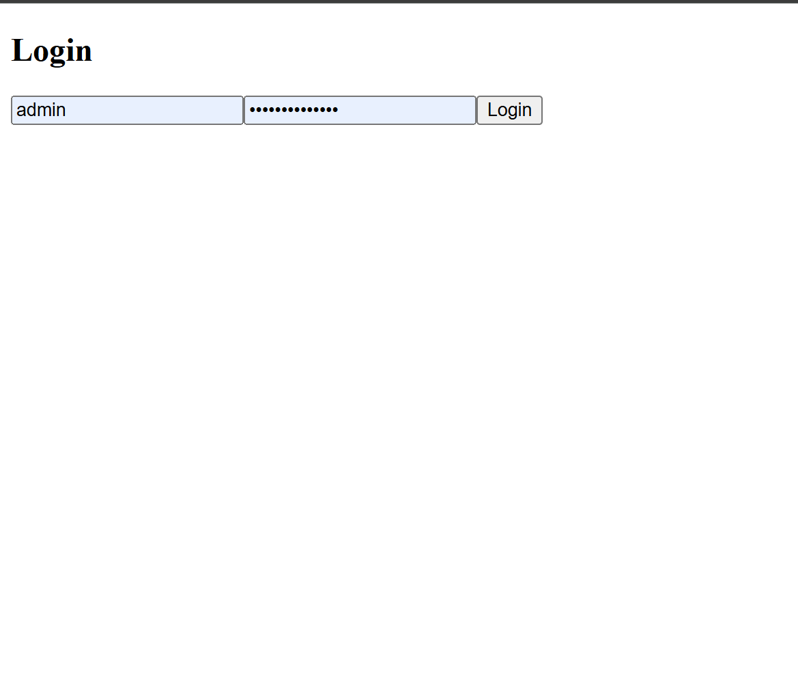
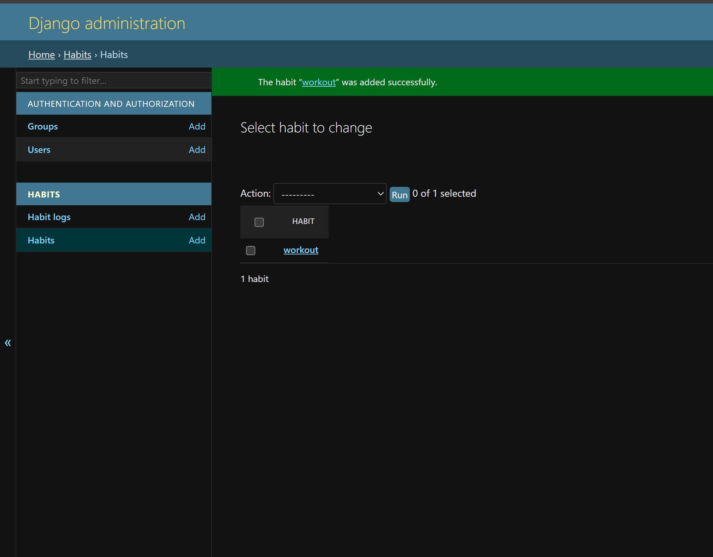
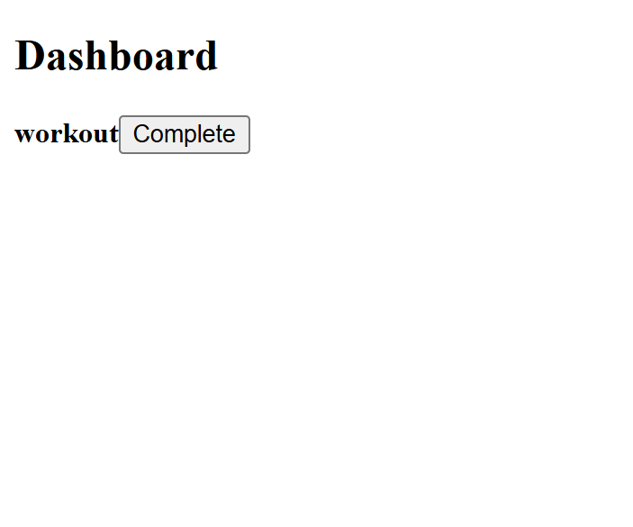

Habit Tracker – Full Stack Application

A full-stack Habit Tracker application built using Django REST Framework (Backend) and React.js (Frontend) with JWT Authentication.
Users can log in, create habits, track daily completion, and view streak statistics.

Tech Stack
Backend

Python 3

Django

Django REST Framework

Simple JWT (Authentication)

MySQL / SQLite (development)

Frontend

React.js

Axios

React Router DOM

Features

User authentication using JWT

Login & protected routes

Create and list habits

Mark habits as completed

Track current streak & longest streak

Dashboard overview

Admin panel for data management

Project Structure
intern mock/
│
├── habit_tracker/               # Django backend
│   ├── habit_tracker/
│   │   ├── settings.py
│   │   ├── urls.py
│   │   └── ...
│   ├── habits/
│   │   ├── models.py
│   │   ├── views.py
│   │   ├── serializers.py
│   │   └── urls.py
│   ├── manage.py
│   └── venv/
│
├── habit-tracker-frontend/      # React frontend
│   ├── src/
│   │   ├── pages/
│   │   │   ├── Login.js
│   │   │   ├── Dashboard.js
│   │   │   └── AddHabit.js
│   │   ├── services/
│   │   │   └── api.js
│   │   ├── App.js
│   │   └── index.js
│   └── package.json

Backend Setup (Django)
1. Create virtual environment
python -m venv venv
venv\Scripts\activate

2. Install dependencies
pip install django djangorestframework djangorestframework-simplejwt mysqlclient

3. Run migrations
python manage.py makemigrations
python manage.py migrate

4. Create superuser
python manage.py createsuperuser

5. Start server
python manage.py runserver

Backend runs at:

http://127.0.0.1:8000/

Frontend Setup (React)
1. Navigate to frontend
cd habit-tracker-frontend

2. Install dependencies
npm install

3. Start frontend
npm start

Frontend runs at:

http://localhost:3000/

Authentication Flow

User logs in via React

React sends credentials to:

POST /api/token/

Django returns:

access token

refresh token

Tokens are stored in localStorage

Axios automatically sends:

Authorization: Bearer <access_token>

Protected APIs are accessible

Important API Endpoints
Endpoint	Method	Description
/api/token/	POST	Get JWT token
/api/habits/	GET, POST	List / create habits
/api/habits/<id>/log/	POST	Mark habit completed
/api/habits/stats/	GET	Habit statistics
/admin/	GET	Django Admin Panel
Axios Configuration (Frontend)
import axios from "axios";

const api = axios.create({
  baseURL: "http://127.0.0.1:8000/api/",
});

api.interceptors.request.use((config) => {
  const token = localStorage.getItem("access");
  if (token) {
    config.headers.Authorization = `Bearer ${token}`;
  }
  return config;
});

export default api;

Common Issues & Fixes
401 Unauthorized

Ensure token is stored in localStorage

Ensure Axios sends Authorization header

Network Error

Backend server must be running

Correct base URL (127.0.0.1:8000)

Empty Dashboard

API request failed due to missing token

Screenshots / Demo

Sumaiya
Internship Task – Habit Tracker Application

Status

✅ Backend Working
✅ Frontend Working
✅ Authentication Implemented
✅ Dashboard Rendering